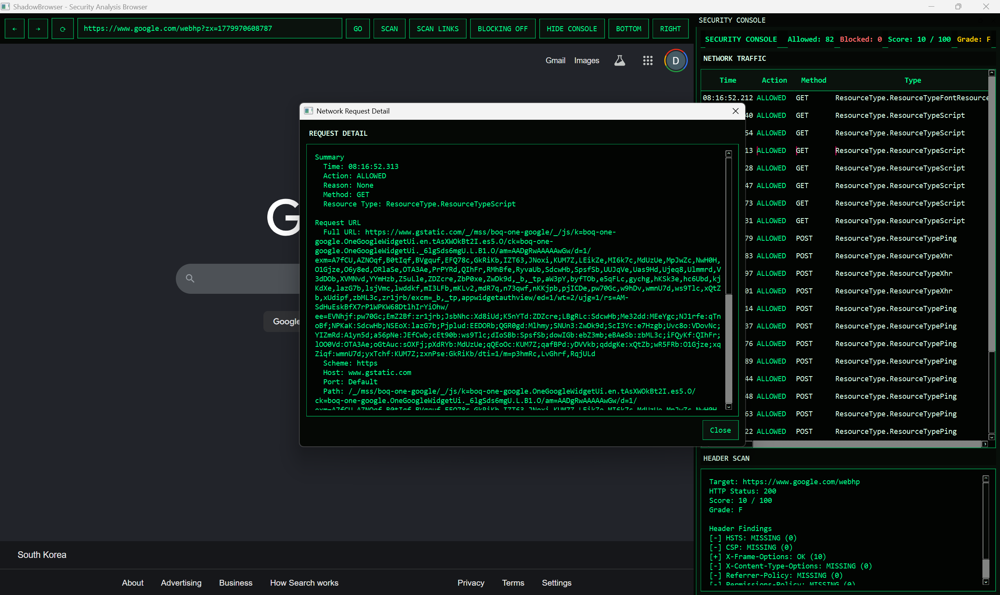

# ShadowBrowser

Security-focused Python web browser prototype built with PySide6 and Qt WebEngine.



## Features

- Basic web browsing with back, forward, reload, and URL navigation
- Security header scan with score and grade
- Network traffic console with per-page request history
- Optional request blocking for tracker-like URLs and mixed HTTP subresources
- Double-click request details in the network table
- VirusTotal-based link safety scan for `http://` and `https://` page links

## Run

```powershell
venv\Scripts\python.exe main.py
```

## VirusTotal API

Link scanning requires a VirusTotal API key.

```powershell
$env:VIRUSTOTAL_API_KEY="your_api_key_here"
venv\Scripts\python.exe main.py
```

## Status

Early MVP. More detailed documentation and screenshots will be added later.
